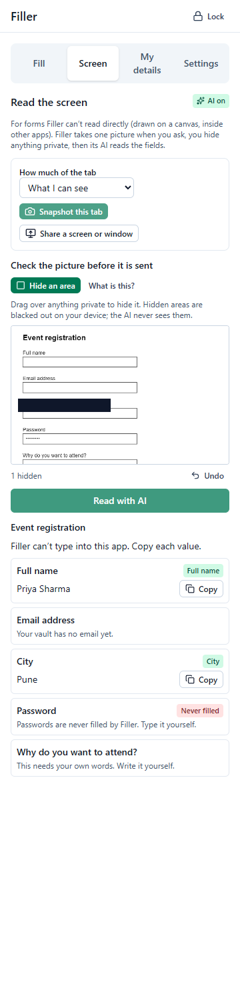
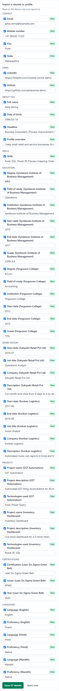

# Filler

**Fill any form once.** Filler is a Chrome/Edge extension that remembers your details in an encrypted vault, fills the forms you open, asks you once for anything it doesn't know, and (optionally) drafts answers like a profile overview from your own facts. **You always review, and you always press Submit yourself.**

It works on any site where you fill in details: freelance profiles (Upwork, Fiverr…), job and internship applications, Google Forms, hackathon registrations, college and scholarship forms. Passwords, OTPs, card and bank details, Aadhaar, PAN, passport and other ID numbers are **never** filled or stored.

| Start a session                      | AI draft card                           | Screen mode                                 | Résumé import                                 |
| ------------------------------------ | --------------------------------------- | ------------------------------------------- | --------------------------------------------- |
|  |  |  |  |

## What it does

- **Vault:** your details, encrypted on your device with a passphrase only you know (AES-256-GCM, PBKDF2 600k).
- **Fill:** reads the page, matches each field to your details, and shows a plan. You approve, it types. Works with React/Angular forms, custom dropdowns, shadow DOM and iframes.
- **Ask once:** a detail you type is remembered for next time (on any site).
- **AI help** (optional, needs sign-in):
  - understands unfamiliar questions;
  - drafts open-ended answers from the facts you tick;
  - reads a picture of a screen Filler can't read directly;
  - imports a résumé.

  It never sees your contact details, passwords or anything marked private.

- **Works offline:** with no account or AI, Filler still fills from your vault and asks you for the rest.
- **Sync** (optional): your vault, end-to-end encrypted, between your devices.

## Quick start (no account needed)

Requirements: Node 22+ and pnpm 9 (`npm i -g pnpm@9`), Chrome or Edge.

```bash
pnpm install
```

```bash
pnpm --filter @filler/extension build
```

Then load it:

1. Open `chrome://extensions` (or `edge://extensions`) and turn on **Developer mode**.
2. Click **Load unpacked** and choose `apps/extension/.output/chrome-mv3`.
3. Pin Filler, open any page with a form, and click the Filler icon. The side panel opens.
4. Create your vault (pick a passphrase you will remember: it cannot be recovered), add a few details or import a résumé, then press **Start on this page**.

Try it on the bundled practice forms:

```bash
pnpm fixtures
```

Then open http://127.0.0.1:5178/.

## Optional: account, sync and AI

Everything above works without this. To turn on sign-in, encrypted sync and AI help:

1. **Supabase (free):** create a project at <https://supabase.com>. Copy `.env.example` to `.env` at the repository root and fill in the two **public** values: `VITE_SUPABASE_URL` and `VITE_SUPABASE_ANON_KEY`.
2. In Supabase:
   - make the email template show the 6-digit code (`{{ .Token }}`);
   - apply `supabase/migrations/*.sql`;
   - deploy the functions `health`, `ai-classify`, `ai-generate`, `ai-vision` and `ai-extract`.
3. **AI key (free tier):** create a key yourself (Google AI Studio recommended; Groq, OpenRouter or local Ollama also work) and store it **as a Supabase secret**, never in the repository:
   ```
   supabase secrets set AI_PROVIDER=gemini GEMINI_API_KEY=<your key> AI_MODEL_FAST=<model> AI_MODEL_SMART=<model> AI_MODEL_VISION=<model>
   ```
4. Rebuild the extension, sign in from **Settings → Account**, and press **Settings → AI help → Test AI connection**.

Full steps: [`supabase/README.md`](supabase/README.md).

## Documentation

- [User guide](docs/USER_GUIDE.md): onboarding, vault, sessions, AI drafts, Screen mode, privacy controls, FAQ
- [Privacy](docs/PRIVACY.md): what stays on your device and what is sent where
- [Security audit](docs/SECURITY_AUDIT.md)
- [Developer guide](docs/DEVELOPER_GUIDE.md): architecture tour, packages, message contract, extending Filler, tests
- [Architecture](docs/ARCHITECTURE.md) · [Build playbook](docs/PLAYBOOK.md) · [Progress](PROGRESS.md)
- [Demo script](docs/DEMO_SCRIPT.md) · [Report notes](docs/REPORT_NOTES.md) · [Manual tests](docs/MANUAL_TESTS.md) · [Store listing](docs/STORE_LISTING.md)

## Development

```bash
pnpm dev
```

The full check, run before every commit:

```bash
pnpm typecheck && pnpm lint && pnpm test && pnpm e2e
```

`pnpm dev` launches Chromium with the extension. On a new machine, run `pnpm e2e:install` once. Tests never touch real websites or real AI providers (local fixtures and a local mock backend).

## License

Not yet chosen. All rights reserved by the authors until a license is added.
