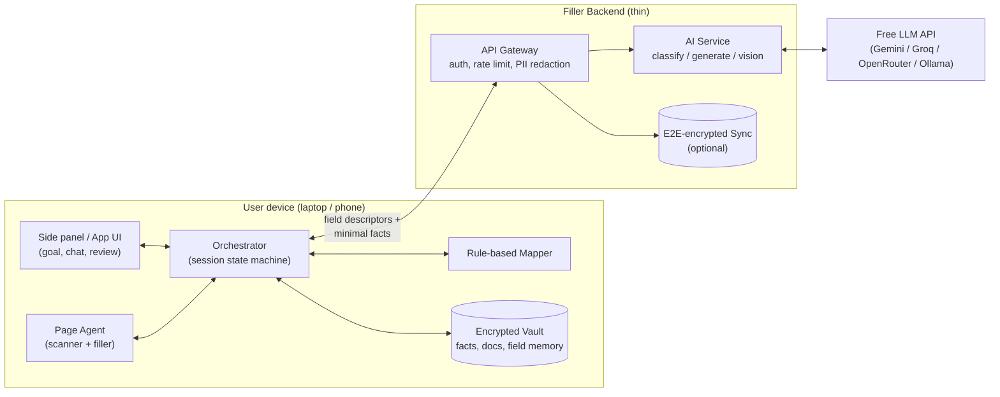
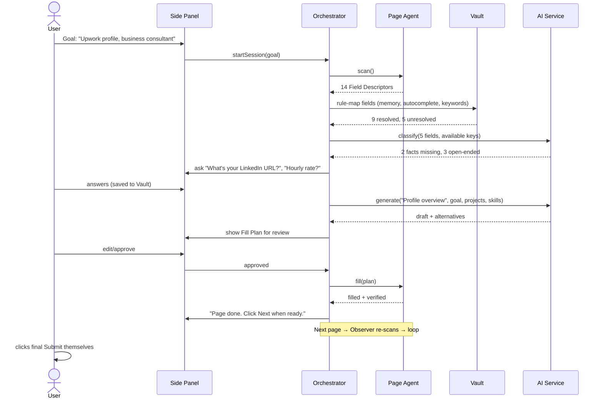

# Filler — System Architecture (Draft v0.1)

> Status: **v1.0, as built (2026-10-03).** The original design below still holds; §0 lists where the build differs or goes further. Companion documents: [PLAYBOOK.md](PLAYBOOK.md) (how it was built), [DEVELOPER_GUIDE.md](DEVELOPER_GUIDE.md), [PRIVACY.md](PRIVACY.md), [SECURITY_AUDIT.md](SECURITY_AUDIT.md).
> **1. Architecture (this file)** → 2. Playbook (phase-by-phase AI build prompts) → 3. Documentation (developer + user docs).

---

## 0. As built (v1.0)

| Area | As built |
|---|---|
| Client | Chrome/Edge MV3 extension (WXT + React 19 + Tailwind v4): background service worker (session host, vault, AI client, capture), side panel, page agent injected on demand (no content scripts, no host permissions at install). |
├─ supabase/            # migrations, Edge Functions (AI gateway, envelopes), function tests
| AI functions | `health`, `ai-classify` (fast model), `ai-generate` (smart), `ai-vision` (vision), `ai-extract` (smart, résumé import). One gateway: Gemini / Groq / OpenRouter / Ollama adapters over plain REST, retries, timeouts, fallback order, token caps. Model names only in secrets. Per-user **and global** daily limits, checked before any call. |
| Safety envelope | Delimited, escaped untrusted data; strict schemas; per-item guards (ids, links, action words, real keys); deny policy re-applied on server and client; **invention check** for drafts and extraction. Classification cache holds no personal data. Logs are metadata only. |
| Vault | IndexedDB (Dexie) tables: facts, documents, field memory, answers, **history**. AES-256-GCM per record, AAD bound to table and id. PBKDF2-SHA256 600k (Argon2 was not used: WebCrypto has no Argon2). **Fact row ids are HMAC hashes**, so no key names are stored readably. Backups and sync are end-to-end encrypted (one opaque blob per user). |
| Drafting | User-triggered only. "Using: …" chips show which public facts may be sent; personal and restricted facts are never selectable. Drafts are never auto-approved. |
| Vision | Tab snapshot (up to 3 screens) or screen/window share. Preview first. Never-fill fields blacked out automatically, user-drawn areas painted over on the device, alignment guard. Two tiers: relabel DOM fields, or a copy-to-clipboard list. |
| Site-agnostic + profiles | Works on any site with no profile. JSON **platform profiles** by family (freelance, jobs, online forms, events, college/government) plus Upwork only add tips, length windows, more-confident mappings, goal defaults and never-click texts. |
| Résumé import | PDF (pdf.js) / DOCX (mammoth) / text read on the device; contacts extracted locally and never sent; AI extraction checked against the text; review before saving. |
| Submit safety | Refused in code: commit words in any button name, buttons that would submit their form, unlabelled buttons. Filler never auto-clicks; the user clicks Next and Submit. |
| Not built (future) | Android client, Firefox build, desktop companion, iOS. |

## 1. Problem

Every platform (Upwork, Fiverr, Google Forms, job portals, college forms, KYC-lite forms…) asks for the same personal details again and again, plus open-ended questions ("Describe your previous projects", "Why are you a good fit?") that take real thought. Filling them is slow, repetitive, and error-prone, on both laptop and phone.

## 2. What Filler does

1. **You tell Filler things once.** Name, phone, email, address, education, skills, projects, work history, résumé, etc. It stores them in an encrypted local vault.
2. **You give Filler a goal.** Example: *"Create my Upwork profile as a business consultant."*
3. **Filler reads the current screen/form**, understands what every field is asking, and builds a fill plan:
   - **Known field** (e.g. "Full name") → fills from the vault.
   - **Unknown fact** (e.g. "LinkedIn URL" not in vault yet) → **asks you once**, saves the answer, never asks again.
   - **Open-ended field** (e.g. "Profile overview") → **drafts an answer** from your vault + the goal + what's already filled on the page, and shows it to you for approval/editing.
4. **You review, then Filler fills.** It types into the fields, moves to the next step/page, and repeats.
5. **You press the final Submit yourself.** Filler never submits, pays, solves CAPTCHAs, or enters passwords.

## 3. Guiding principles

| Principle | Meaning in practice |
|---|---|
| Ask once, reuse forever | Every answer the user gives becomes a reusable vault fact (with consent). |
| Human-in-the-loop | Nothing is typed without a visible plan; nothing is submitted by Filler. |
| Local-first privacy | Vault lives encrypted on the device. The AI receives only the minimum data needed for the current field. |
| Deterministic before AI | Use cheap, reliable rules (HTML `autocomplete`, labels, known field names) first; call the LLM only for what rules can't resolve. |
| Read the DOM, not pixels (when possible) | On web, reading page structure is far more accurate than screenshots. Vision is a fallback. |
| Excluded data | Passport numbers, government IDs, bank/card details and passwords are **never stored or filled** (user-configurable deny-list, on by default). |

---

## 4. High-level architecture



Three layers:

1. **Client (on device)** — does the seeing, the filling, the storing, and the talking to the user.
2. **Backend (thin)** — holds the LLM API key, strips/limits PII, runs prompts, optionally syncs the encrypted vault between devices.
3. **LLM** — understands fields and writes answers. Swappable (cloud model or a local model for a "privacy mode").

---

## 5. Client components (laptop: browser extension)

Laptop MVP is a **Chrome/Edge extension (Manifest V3)**. An extension can read and fill any web page's form reliably, which covers Upwork, Fiverr, Google Forms, and most "fill your details" cases. Full desktop-app control (non-browser software) is a later phase via vision (§9).

### 5.1 Page Agent (content script)
Runs inside each web page.

- **Scanner** — finds every fillable control: `input`, `textarea`, `select`, radio/checkbox groups, `contenteditable`, custom dropdowns (ARIA `combobox`/`listbox`), shadow DOM, same-origin iframes.
- **Field Descriptor builder** — for each control, extracts:
  - label text (via `<label for>`, `aria-label`, `aria-labelledby`, placeholder, nearest preceding text)
  - `name`, `id`, `type`, `autocomplete`, `required`, `maxlength`, `pattern`
  - options (for select/radio/checkbox)
  - section heading and help text around it
  - current value
  - a stable **field signature** = hash(site + normalized label + type + name)
- **Filler** — writes values the way a human would so React/Angular/Vue forms register them: focus → set native value setter → dispatch `input`/`change`/`blur`; types character-by-character where required; opens custom dropdowns and clicks the matching option.
- **Observer** — `MutationObserver` watches for new fields (multi-step wizards, "Add another project" buttons) and page navigation, then re-scans.
- **Highlighter** — overlays colored outlines: green = will fill from vault, yellow = AI draft awaiting approval, red = needs user input.

### 5.2 Orchestrator (background service worker)
The brain on the client. A **session state machine**:

```
IDLE → GOAL_SET → SCANNING → MAPPING → PLANNING → AWAITING_REVIEW → FILLING → VERIFYING
                      ↑                                                      │
                      └──────────── next page / new fields detected ─────────┘
                                                      │
                                                 READY_TO_SUBMIT (user clicks submit)
```

Responsibilities:
- Keeps **session context**: goal, platform, all fields seen so far and their final values (so later answers stay consistent with earlier ones).
- Calls the Mapper, then the AI service only for unresolved fields.
- Produces a **Fill Plan** (list of `field → value, source, confidence`).
- Enforces policy (deny-list, never-submit, sensitivity rules).

### 5.3 Rule-based Mapper (local, no AI)
Maps a Field Descriptor to a **canonical key** in the vault schema (e.g. `person.name.first`, `contact.phone.mobile`, `address.city`, `education[0].degree`).

Order of resolution:
1. **Field memory** — have we seen this exact field signature before? Use the stored mapping.
2. **HTML `autocomplete` attribute** — e.g. `given-name`, `tel`, `postal-code` map directly.
3. **Keyword/regex dictionary** on label/name/id (multi-language friendly, e.g. "mobile", "phone no", "contact number" → `contact.phone.mobile`).
4. **Unresolved** → send to AI classification.

### 5.4 Encrypted Vault
- Storage: IndexedDB (extension); a future mobile client would use an encrypted local database.
- Encryption: AES-256-GCM; key derived from the user's passphrase with PBKDF2-SHA256 (600,000 iterations); key kept only in memory while unlocked.
- Contents (see §7): **Facts**, **Documents** (résumé, portfolio text), **Field Memory**, **Answer History** (past AI drafts the user approved, reusable per platform).
- Every fact has a **sensitivity tier**: `public` (name, skills), `personal` (phone, address, DOB), `restricted` (never sent to cloud AI; filled locally only), `denied` (passport, gov ID, bank, passwords — never stored).

### 5.5 Side Panel UI
Chrome Side Panel (React):
- **Goal box** — "What are we doing?" (e.g. "Upwork profile, business consultant, target US SMB clients").
- **Questions** — "What should I put for *Date of birth*?" → user answers once → saved.
- **Review list** — each planned value with source badge (Vault / AI draft / You), edit, approve, skip.
- **Fill** button and per-field "Fill this only".
- **Vault manager** — view/edit/delete facts, import résumé, set deny-list.

---

## 6. AI layer

Hosted behind the backend (so the API key is never in the extension). Three capabilities, each a separate endpoint with a strict JSON output schema:

### 6.1 `classify` — "What is this field asking?"
- **Input:** Field Descriptor(s) (label, type, options, section, help text), list of canonical keys available (**keys only, no values**), platform + goal.
- **Output:** `{ fieldId, kind: "fact" | "open_ended" | "choice" | "skip", canonicalKey?, confidence, reason }`.
- Batched: one call classifies all unresolved fields on a page.
- Model: the provider's fast free model (`AI_MODEL_FAST`).

### 6.2 `generate` — "What's the best answer here?"
- **Input:** field descriptor + constraints (max length, options), the goal, platform, **only relevant facts** (selected by the orchestrator, e.g. projects + skills for "Previous projects"), values already filled in this session, previously approved answers for similar questions.
- **Output:** `{ value, alternatives[], rationale, usedFacts[] }`.
- Writes answers optimized for the goal (e.g. client-winning Upwork overview), respecting character limits and choosing from allowed options.
- Model: the provider's strongest free model (`AI_MODEL_SMART`). Must never invent facts: if a needed fact is missing, it returns `needsInput: ["what was your role in project X?"]` instead.

### 6.3 `vision` (later phase) — "What's on this screen?"
- **Input:** screenshot (+ optional accessibility tree).
- **Output:** list of fields with bounding boxes → converted to Field Descriptors.
- Used when DOM is unavailable: canvas UIs, desktop apps, some mobile screens.

### 6.4 Prompt & safety rules (apply to all)
- Output is validated against a schema (Zod/Pydantic); invalid → retry once → fall back to asking the user.
- Page text is treated as **untrusted data** (defends against prompt injection hidden in web pages).
- No passwords, payment data, CAPTCHAs, gov IDs ever — enforced in code, not just in prompts.
- Provider abstraction: `LLMProvider` interface so we can swap Gemini ↔ Groq ↔ OpenRouter ↔ local Ollama without touching callers.
- Free tiers may use prompts to improve the provider's models, which is one more reason for strict data minimisation.

---

## 7. Data model (core)

```ts
// Vault
Fact {
  key: string            // canonical, e.g. "contact.phone.mobile"
  value: string | object
  sensitivity: "public" | "personal" | "restricted"
  source: "user" | "resume_import" | "ai_suggested_approved"
  updatedAt: ISODate
}

Document {               // résumé, portfolio, bio
  id, type, text, parsedFacts: Fact[], createdAt
}

FieldMemory {            // learns per site
  signature: string      // hash(site + label + type + name)
  site: string
  canonicalKey?: string
  lastValueRef?: string  // pointer to Fact or Answer
  timesUsed: number
}

Answer {                 // approved AI drafts, reusable
  id, questionText, platform, goal, value, approvedAt
}

// Session (in memory, per tab)
Session {
  goal: string
  platform: string       // "upwork.com"
  pages: PageSnapshot[]
  fields: FieldDescriptor[]
  plan: PlanItem[]       // { fieldId, value, source: "vault"|"ai"|"user", confidence, status }
}
```

Canonical key schema (starter set): `person.*` (name, dob, gender), `contact.*` (email, phone), `address.*`, `education[]`, `experience[]`, `projects[]`, `skills[]`, `languages[]`, `links.*` (linkedin, github, portfolio), `preferences.*` (hourly rate, availability, timezone), `bio.*` (headline, short/long summary).

---

## 8. End-to-end flow (example: Upwork profile)



---

## 9. Platform strategy

| Platform | Approach | Feasibility | Phase |
|---|---|---|---|
| **Laptop – browser** (Chrome, Edge, Brave) | MV3 extension, DOM access | High — covers Upwork, Fiverr, Google Forms, most portals | MVP |
| **Laptop – Firefox** | Same code via WebExtension polyfill | High | Later |
| **Laptop – desktop apps** | Screenshot + vision model + OS input automation (companion desktop app) | Medium, slower, less accurate | Later |
| **Android** | Native app using **AccessibilityService** (read screen tree, set text) + **Autofill Framework** | Medium–High | Phase 5 |
| **iOS** | Apple blocks screen control. Options: Safari Web Extension (web forms only), custom keyboard that suggests values | Low–Medium | Stretch |

The Orchestrator, Mapper, Vault format and AI service are **shared** across platforms; only the Page Agent (scanner/filler) and UI are platform-specific. Hence a monorepo with shared packages.

---

## 10. Tech stack (as built)

| Layer | Choice | Why |
|---|---|---|
| Language | TypeScript everywhere (client + backend) | One language, shared types |
| Monorepo | pnpm workspaces + Turborepo | Shared `core` package across extension/mobile/backend |
| Extension framework | WXT + React 19 + Tailwind v4 + Zustand | MV3 boilerplate, hot reload, side panel support |
| Validation | Zod | Same schemas for AI output, API, storage |
| Local storage | IndexedDB via Dexie + WebCrypto | Encrypted vault in browser |
| Backend | **Supabase** (Auth via email OTP, Postgres + RLS, Edge Functions on Deno) | Chosen. Thin backend, no server to run |
| LLM | **Free online API**: Gemini free tier (default, has vision), Groq and OpenRouter free models as alternatives, Ollama for local mode; all behind one provider interface, model names in config | Chosen. Zero cost; swappable when free tiers change |
| Android (later) | Kotlin native (AccessibilityService) + shared logic via backend/JS bridge | Required for screen access |
| Testing | Vitest (unit), Playwright (fill real test forms), fixture pages of Upwork/Fiverr/Google Forms-like forms | Repeatable e2e |

### Repo layout (target)
```
filler/
├─ docs/                 # architecture, playbook, docs
├─ packages/
│  ├─ core/              # types, canonical schema, mapper, orchestrator state machine, policy
│  ├─ vault/             # encryption + storage adapters
│  ├─ ai-client/         # typed client for backend AI endpoints
│  └─ ui/                # shared React components
├─ apps/
│  ├─ extension/         # MV3 extension (content script, service worker, side panel)
│  ├─ backend/           # API gateway + AI service + prompts
│  └─ android/           # later
└─ test-fixtures/        # sample forms for e2e tests
```

---

## 11. Security & privacy

- **Vault encrypted at rest**, locked after inactivity; passphrase never leaves the device.
- **Data minimization to AI:** `classify` sees field text + key names only; `generate` sees only facts the orchestrator selects for that field; `restricted` facts are never sent.
- **Deny-list enforced in code:** fields detected as password, card number, CVV, bank account, passport, Aadhaar/PAN/SSN-like IDs are skipped and highlighted red.
- **No auto-submit, no CAPTCHA solving, no account passwords.** The user performs these.
- **Prompt-injection defense:** page content is wrapped as data; the AI can only return schema-valid fill values, never actions.
- **Permissions:** extension activates only on the tab where the user starts a session (`activeTab`), not on all sites all the time.
- **Platform terms:** some sites restrict automation. Filler stays an *assistant the user drives* (human reviews and submits), which keeps it within normal use in most cases, but it should be documented.

---

## 12. Non-functional targets (MVP)

| Metric | Target |
|---|---|
| Correct field mapping on test fixtures | ≥ 90% |
| Time from "scan" to plan shown (20 fields) | < 5 s |
| LLM cost per form page | < ₹1 (batched classify, generate only open-ended) |
| Zero writes to denied field types | 100% (tested) |

---

## 13. Build phases

The full phase-by-phase plan (Phases 0–12, with prompts, rules and DONE criteria for every task) is in [PLAYBOOK.md](PLAYBOOK.md). Progress is tracked in `PROGRESS.md` at the project root.

---

## 14. Decisions

| Question | Decision (2026-09-30) |
|---|---|
| Backend | Supabase |
| LLM provider | Free online API (Gemini default; Groq / OpenRouter alternatives). User supplies keys at the Phase 8 checkpoint |
| Mobile | Deferred. Extension first; Android gets its own playbook later. `packages/core` stays platform-neutral so Android can reuse it |
| Timeline / team | 13 phases (0–12), buildable solo; team split for 2–4 people in PLAYBOOK §0.12 |
| Screen sharing | Included (Phase 10): share a tab/screen, AI reads it and suggests what to fill; copy-to-paste for apps Filler can't type into |
