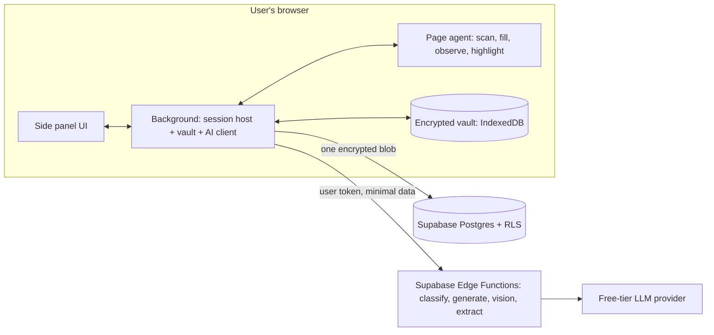
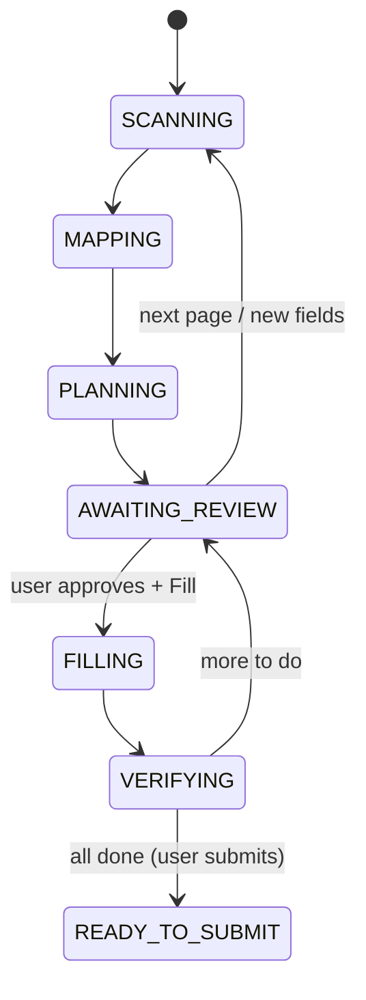

# Filler — notes for the project report

Material for the BE project report: problem, objectives, related work, design, implementation, testing, limitations and future scope. Diagrams are Mermaid (render on GitHub, or paste into mermaid.live to export images).

## 1. Problem statement

People fill the same personal and professional details again and again: freelance profiles, job and internship applications, Google Forms, hackathon registrations, college and scholarship forms. Open questions ("Describe your projects", "Why should we hire you?") take real effort each time. Existing autofill handles only a few basic fields (name, address, card), cannot answer open questions, and offers no review or privacy controls for sensitive identifiers.

## 2. Objectives

1. Store the user's details once, in an encrypted vault under the user's sole control.
2. Fill forms on **any** website correctly, including modern framework-driven forms, without per-site code.
3. Ask for each missing detail only once and remember it.
4. Use AI, optionally, to understand unfamiliar questions and draft truthful, goal-aware answers from the user's own facts only.
5. Read forms that cannot be accessed programmatically (canvas apps, other programs) from a picture the user approves.
6. Keep the human in control: a visible plan before typing, no automatic submission, and a hard ban on passwords, payment data and government IDs.
7. Work fully offline (no account, no AI) with graceful degradation.

## 3. Existing approaches (literature and tools)

| Approach | Example | Strengths | Gaps Filler addresses |
|---|---|---|---|
| Browser autofill | Chrome/Edge autofill | Built in, fast | Only standard fields via `autocomplete`; no open questions; no review per field; no repeating sections (education/jobs); no learning from unusual labels |
| Password-manager autofill | Bitwarden, 1Password identities | Encrypted storage | Built for credentials and payment cards; limited identity fields; no AI drafting; treats exactly the data Filler refuses (passwords/cards) as its core use |
| Form-filler extensions | Rule/macro recorders | Replays fixed values | Per-site recording, breaks on layout changes; no understanding of new questions |
| Generic AI browser agents | LLM agents that click and type | Flexible | Send whole pages and personal data to the model; act autonomously (including submitting); vulnerable to prompt injection; no structured vault |
| Résumé parsers | ATS parsing services | Structured extraction | Upload the résumé to third parties; one-directional |

Filler combines a deterministic rule engine (fast, private, testable) with a narrowly scoped AI layer that receives the minimum data, plus code-enforced safety rules.

## 4. System architecture

### Modules
- **Page agent:** finds every fillable control (inputs, selects, radio/checkbox groups, ARIA widgets, contenteditable, shadow DOM, iframes) and resolves labels with an 8-step strategy. It fills the way a human would so React/Angular register the change, verifies each value, watches for new fields, and highlights fields by state. Submit-like buttons are refused in code.
- **Mapper (rules):** maps each field to one of 64 canonical keys through, in order:
  - the deny policy;
  - skip rules;
  - field memory;
  - HTML `autocomplete`;
  - the user's custom facts;
  - a keyword dictionary with section context;
  - option-set recognition.

  Values are formatted losslessly: names, phones, dates and options.
- **Orchestrator:** a pure reducer (no I/O), reusable by a future Android client. It holds the session state, consistency across pages, ask-once memory, drafts and history.
- **Vault:** AES-256-GCM per record (AAD binds record to its table/id), PBKDF2-SHA256 600k key derivation, HMAC-hashed row ids, auto-lock, encrypted backups, end-to-end encrypted sync with conflict copies.
- **AI layer:** a provider gateway (Gemini/Groq/OpenRouter/Ollama) with retries, fallback and token caps. A safety envelope delimits and escapes untrusted data, validates outputs strictly, re-applies the policy and runs an invention check. Per-user and global quotas apply.
- **Platform profiles:** JSON configuration per family of sites that only adds tips, length windows and more-confident mappings.
- **Screen mode:** tab snapshot or screen share, on-device blackout, vision reading, then a copy list or relabelled page fields.

## 5. Implementation summary

| Item | Choice |
|---|---|
| Languages | TypeScript (strict) everywhere |
| Client | Chrome/Edge MV3 extension, WXT, React 19, Tailwind v4, Zustand, Zod |
| Storage / crypto | IndexedDB (Dexie), WebCrypto |
| Backend | Supabase: Auth (email code), Postgres + Row Level Security, Edge Functions (Deno) |
| AI | Free-tier LLMs behind one interface; model names in configuration |
| Parsing | pdf.js, mammoth (client side) |
| Tests | Vitest, Playwright, PGlite (real Postgres in process for RLS tests) |
| Repo | pnpm workspaces + Turborepo: `packages/{core,vault,ai-client,ui}`, `apps/extension`, `supabase` |

## 6. Testing and results

- **Unit and integration:** about 730 tests across core, vault, extension, AI client and Supabase functions (exact counts in PROGRESS.md).
- **End-to-end:** about 80 Playwright tests drive the real extension in Chromium on 13 local fixture forms, with a mock backend running the real function code. Every test fails on any console error.

**Accuracy on fixtures** (real scanner output, scored against hand-labelled expected results):

| Measure | Result | Target |
|---|---|---|
| Rules only (no AI), field kind + key | 99 / 100 | ≥ 85% |
| Rules + platform profiles | 100 / 100 | not below rules |
| Rules + AI classify (scripted model), kind | 119 / 120 (99.2%) | ≥ 95% |
| Rules + AI classify, key | 118 / 120 (98.3%) | ≥ 90% |
| Vision label match (scripted recordings) | 106 / 113 (93.8%) | ≥ 80% |

**Performance** (Chromium, laptop): scan → plan for a 25-field page in about 0.1 s median (target < 5 s). AI classify sends one batched call per page, about 1,300 input tokens for 12 unknown fields: ₹0 on free tiers, a few paise at typical paid "flash" rates.

**Security:** see SECURITY_AUDIT.md.
- The secret scan of the whole history is clean.
- Permissions are minimal, with the strict MV3 CSP and no remote code.
- No plaintext at rest.
- The AI payload audit across all four endpoints shows no private data sent.
- Adversarial prompt-injection suites (including text in images) pass.
- 18 disguised submit buttons are all refused.
- RLS isolation is proven on real Postgres, and `pnpm audit` is clean.

Four issues found in the audit were fixed:
1. readable fact key names at rest;
2. form-submitting "Next" buttons;
3. a memory leak on long use;
4. the user's city reaching AI drafts as "already filled" context.

## 7. Limitations

- AI quality was measured with scripted model responses; live-model accuracy needs a real API key (set-up steps documented).
- Tab snapshots need the user to click the toolbar button on that tab (Chrome's `activeTab`); hiding areas in pictures needs a pointer.
- Filler cannot type into other desktop applications (copy suggestions only); it never handles CAPTCHAs, uploads or submission.
- Free-tier AI providers may use prompts to improve their models; Filler minimises what it sends, and AI can be turned off.
- Chrome/Edge only.

## 8. Future scope

1. **Android client:** an AccessibilityService and Autofill Framework client reusing `packages/core` (mapper, policy, orchestrator), the vault format and the same Edge Functions.
2. **Firefox build** (WebExtension; WXT supports it).
3. **Desktop companion** for native apps using the vision pipeline.
4. On-device models (e.g. Ollama/Gemini Nano) for a fully local AI mode.
5. Signed, community-maintained platform profiles.
6. Accessibility: keyboard-only area hiding in Screen mode.

## 9. Ethics and safety

The user submits; Filler never does. No credentials, payment data or government IDs are handled. AI drafts use only the user's facts (an invention check enforces this). Page text and images are treated as untrusted. Data minimisation applies throughout, and everything can be deleted by the user.
